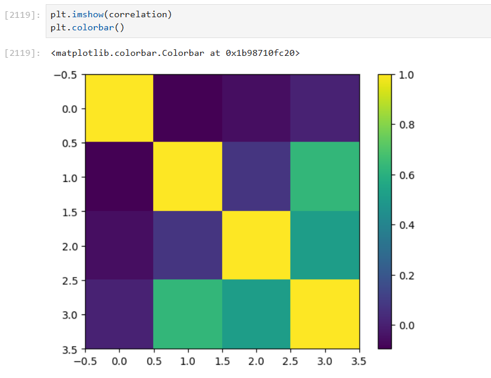
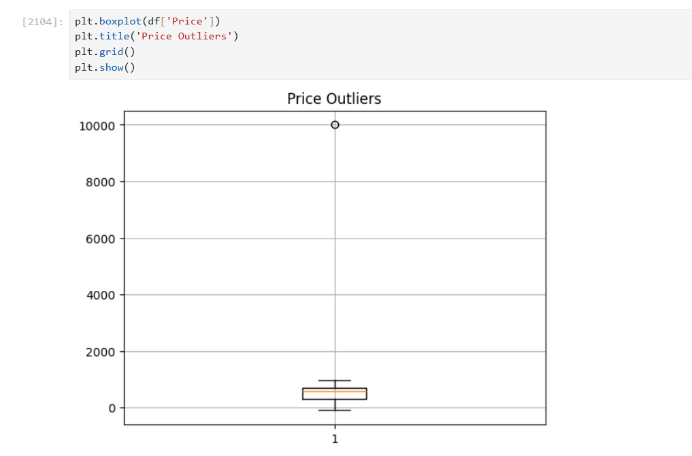

# 📊 E-Commerce Data Analysis (EDA)

## 📌 Overview

This project performs Exploratory Data Analysis (EDA) on an e-commerce dataset to uncover meaningful insights related to sales performance, customer behavior, and revenue patterns.

## 🎯 Objectives

* Analyze sales trends over time
* Understand customer purchasing behavior
* Identify top-performing products and categories
* Discover patterns and correlations in data

## 🛠️ Tools & Technologies

* Python
* Pandas
* NumPy
* Matplotlib
* Seaborn

## 📂 Project File

* `EDA_Ecommerce.ipynb`

## 📸 Key Visualizations

## 📈 Key Insights

* Identified sales trends and seasonal variations
* Found high revenue-generating product categories
* Analyzed customer purchase patterns
* Observed relationships between different variables

## ▶️ How to Use

1. Download or clone the repository
2. Open the notebook in Jupyter Notebook / Jupyter Lab
3. Run all cells to reproduce the analysis

## 👤 Author

Sant
